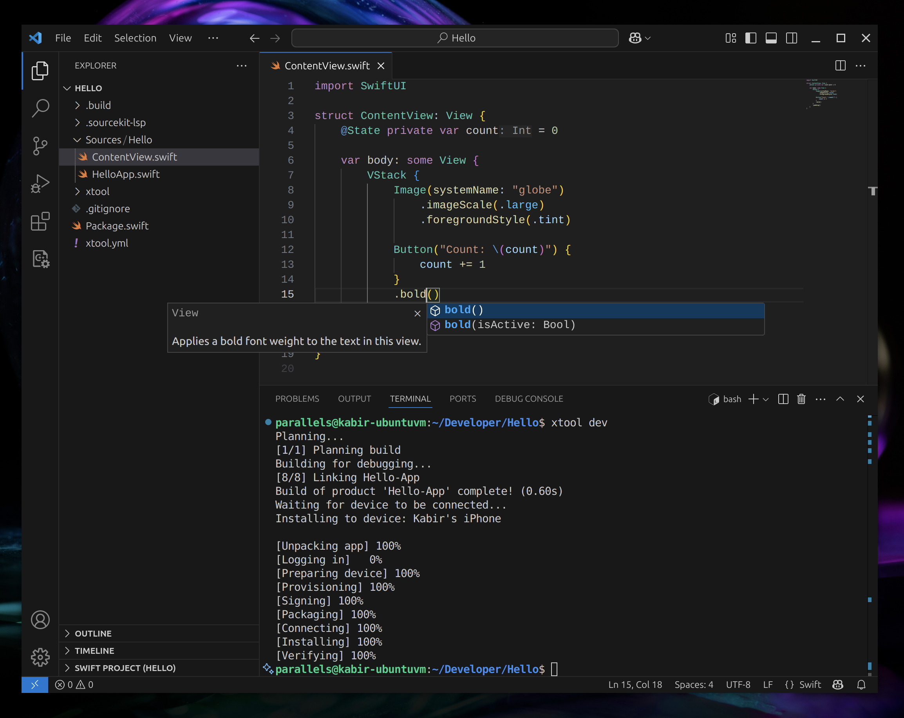

# xtool

Cross-platform Xcode replacement. Build and deploy iOS apps with SwiftPM on Linux and macOS.

## Overview

xtool is a cross-platform (Linux/WSL/macOS) tool that replicates Xcode functionality with open standards.

✅ Build a SwiftPM package into an iOS app

✅ Sign and install iOS apps

✅ Interact with Apple Developer Services programmatically

## Getting Started

1. Follow the guide to install `xtool`
    - [Installation (Linux)](#)
    - [Installation (macOS)](#)
2. Create and run your first xtool-powered app by following the [tutorial](#)!

## Examples

### Screenshot



### Command line interface

```bash
$ xtool --help
OVERVIEW: Cross-platform Xcode replacement

USAGE: xtool <subcommand>

OPTIONS:
  -h, --help              Show help information.

CONFIGURATION SUBCOMMANDS:
  setup                   Set up xtool for iOS development
  auth                    Manage Apple Developer Services authentication
  sdk                     Manage the Darwin Swift SDK

DEVELOPMENT SUBCOMMANDS:
  new                     Create a new xtool SwiftPM project
  dev                     Build and run an xtool SwiftPM project
  ds                      Interact with Apple Developer Services

DEVICE SUBCOMMANDS:
  devices                 List devices
  install                 Install an ipa file to your device
  uninstall               Uninstall an installed app
  launch                  Launch an installed app

  See 'xtool help <subcommand>' for detailed help.
```

### Library

xtool includes a library that you can use to interact with Apple Developer Services, iOS devices, and more from your own app. You can use this by adding `XKit` as a SwiftPM dependency.

```swift
// package dependency:
.package(url: "https://github.com/xtool-org/xtool", .upToNextMinor(from: "1.2.0"))
// target dependency:
.product(name: "XKit", package: "xtool")
```
